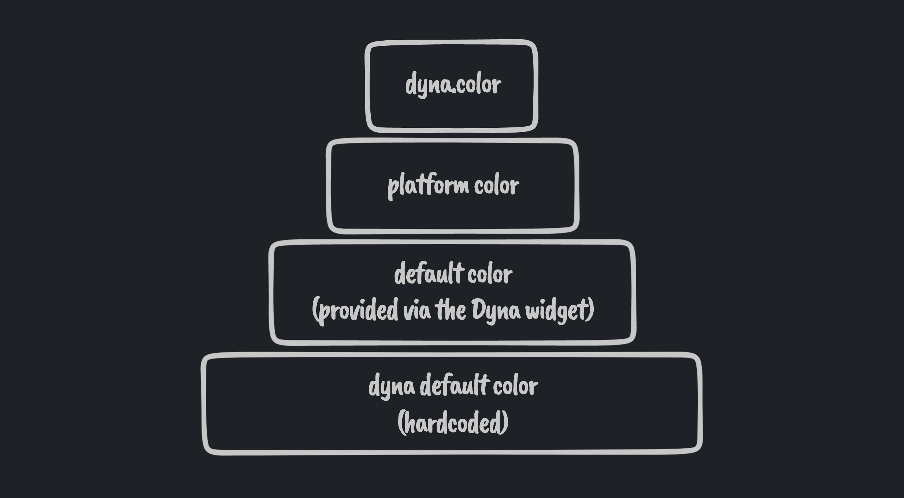

# Dyna
Dyna wraps your app to provide `ColorScheme`s based on user wallpaper (currenly only on Android 12+) or given source color. You can plug these schemes right into your app and update your app's theme in real-time.

https://user-images.githubusercontent.com/2550945/147409734-d8417bef-8428-4109-a199-79ef12966aa6.mp4

```dart
Dyna(
  builder: (context, ColorScheme light, ColorScheme dark) {
    return MaterialApp(
      title: 'Dyna Demo',
      theme: AppTheme.make(light),
      darkTheme: AppTheme.make(dark),
    );
  },
);
```

```dart
ColorPicker(
  pickerColor: context.dyna.color ?? Colors.grey,
  onColorChanged: (color) {
    context.dyna.update(color);
  },
),
```

## Priority



Dyna will use `context.dyna.color` to generate the `ColorScheme`s. If this value is `null` (default), Dyna will try to get a `ColorScheme` from the underlying platform (e.g. wallpaper based on Android). If the platform is not supported, Dyna will then use the given default `color` (to the `Dyna` widget) to generate the `ColorScheme`s. If none is provided, Dyna will use the package default color (`kDynaDefaultColor`).
